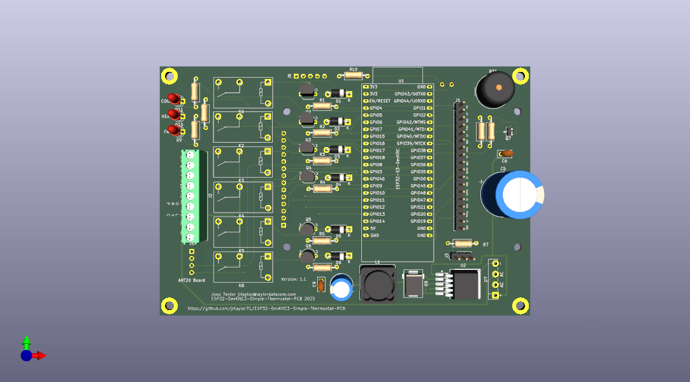
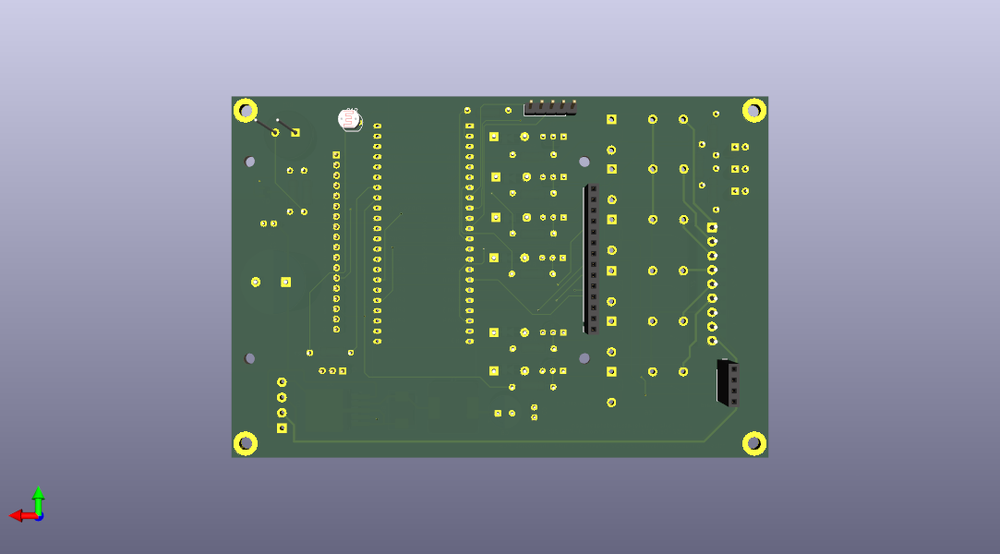

# ESP32-S3-Simple-Thermostat

A comprehensive, feature-rich simple thermostat system built on the ESP32 platform with professional PCB design. Perfect for DIY smart home automation with full Home Assistant integration.

## 🌟 Key Features

- **📱 Local Touch Control**: ILI9341 TFT LCD with intuitive touch interface
- **🏠 Smart Home Ready**: Full MQTT integration with Home Assistant auto-discovery
- **📅 7-Day Scheduling**: Comprehensive inline scheduling with day/night periods and editable Heat/Cool/Auto temperatures
- **🌡️ Multiple Sensors**: AHT20/BME280 for ambient conditions + DS18B20 for hydronic systems
- **⚡ Multi-Stage HVAC**: Support for 2-stage heating and cooling systems
- **💨 Advanced Fan Control**: Auto, continuous, and scheduled cycling modes
- **🚿 Shower Mode**: Pause heating for 5-120 minutes with countdown timer and buzzer alert
- **🌤️ Weather Integration**: OpenWeatherMap and Home Assistant weather with color-coded icons on display
- **🌐 Modern Web Interface**: Complete tabbed interface with embedded scheduling - no separate pages
- **📡 Offline Operation**: Full functionality without WiFi connection
- **🔧 Professional PCB**: Custom PCB design for clean, permanent installation
- **🔄 OTA Updates**: Over-the-air firmware updates with real-time progress tracking
- **🔒 Factory Reset**: Built-in reset capability via boot button
- **🎭 Motion Detection**: LD2410 24GHz mmWave sensor for automatic display wake

## 🚀 Quick Start

### Hardware Requirements
- ESP32-S3-WROOM-1-N16 (16MB Flash, No PSRAM) or N8/N32 variants
- ILI9341 320x240 TFT LCD with XPT2046 Touch Controller
- AHT20 or BME280 Temperature/Humidity Sensor (I2C)
- DS18B20 Temperature Sensor (optional, for hydronic heating)
- LD2410 24GHz mmWave Motion Sensor (optional, for display wake)
- 5x Relay Module for HVAC control
- Custom PCB that can use either onboard relay or external relays via pin header

### Software Setup

#### Option 1: Use Prebuilt Firmware (Recommended)
1. Clone this repository
2. Navigate to `firmware/N8/`, `firmware/N16/`, or `firmware/N32/` directory
3. Find the latest build folder (e.g., `build_YYYYMMDD-HHMMSS/`)
4. Flash using the variant-specific script: `./firmware/latest_flash_N8.sh`, `latest_flash_N16.sh`, or `latest_flash_N32.sh`
5. Use touch interface to configure WiFi and settings

#### Option 2: Build from Source
1. Install [PlatformIO](https://platformio.org/) IDE
2. Clone this repository
3. Open project in PlatformIO
4. Build firmware using `./build.sh` with options:
   - **Interactive mode**: `./build.sh` (select from menu)
   - **Specific variant**: `./build.sh 1` (N8), `./build.sh 2` (N16), or `./build.sh 3` (N32)
   - **All variants**: `./build.sh all` or `./build.sh 4`
   - **Additional flags**: `clean`, `quiet`, `cleanlibs`
   - **Examples**: 
     - `./build.sh 2` - Build 16MB variant (default)
     - `./build.sh all clean` - Clean build all variants
     - `./build.sh 3 quiet` - Build 32MB silently
     - `./build.sh cleanlibs` - Remove all libraries and packages
5. Memory usage: RAM 25.2% (82728/327680 bytes); Flash 19.0% (1246KB/6553KB for N16)
6. Firmware organized in `firmware/N8/`, `firmware/N16/`, `firmware/N32/` directories
7. Flash using variant-specific scripts: `./firmware/latest_flash_N8.sh`, `latest_flash_N16.sh`, or `latest_flash_N32.sh`
8. Use touch interface to configure WiFi and settings

#### Flashing Requirements
- **esptool.py** (installed automatically with PlatformIO)
- **USB connection** to ESP32-S3
- **Boot mode**: Hold BOOT button while connecting USB (if needed)
- **Default serial port**: `/dev/ttyACM0` (Linux/Mac) or `COM3` (Windows)

For detailed build and flash instructions, see [USER_MANUAL.md](USER_MANUAL.md)

## 💻 Web Interface

Access the thermostat's web interface by navigating to its IP address:

### Tabbed Interface with Embedded Features

**Status Tab**: Real-time monitoring of:
- Current temperature and humidity
- Thermostat and fan modes
- Relay states and system status
- Weather information (when configured)
- Barometric pressure (with BME280 sensor)

**Settings Tab**: Complete configuration interface for:

- Temperature setpoints and control modes
- MQTT/Home Assistant integration
- WiFi network settings
- Multi-stage HVAC parameters
- Hydronic heating controls
- Fan scheduling options
- Shower mode enable/disable and duration (5-120 minutes)
- Display brightness and sleep settings
- Temperature/humidity sensor calibration

**Schedule Tab**: Comprehensive 7-day scheduling:
- Day and night periods for each day of the week
- Editable Heat, Cool, and Auto temperatures for each period
- Time controls for period transitions
- Schedule enable/disable and override controls
- All options always visible - no hidden menus

**Weather Tab**: Weather data configuration:
- OpenWeatherMap API integration
- Home Assistant weather entity integration
- Configurable update intervals (5-60 minutes)
- City/state/country configuration

**System Tab**: Device information and firmware updates:
- System information and uptime
- Firmware version details
- OTA firmware upload with progress tracking
- Reboot and factory reset options

For complete usage instructions, see [USER_MANUAL.md](USER_MANUAL.md)

## 🏠 Home Assistant Integration

Automatic discovery and integration with Home Assistant:

1. Enable MQTT in thermostat settings
2. Configure MQTT broker details
3. Thermostat appears automatically in Home Assistant
4. Full control via Home Assistant interface
5. Supports climate entity with heating/cooling modes

## 🛠️ Advanced Features

### Multi-Stage Operation
- Intelligent staging based on time and temperature
- Configurable stage 2 activation parameters
- Prevents system short-cycling
- Optimizes energy efficiency

### Hydronic Heating Support
- DS18B20 water temperature monitoring
- Safety interlocks prevent operation when water is too cold
- Configurable high/low temperature thresholds
- Perfect for radiant floor heating systems

### Fan Control Options
- **Auto**: Fan runs only with heating/cooling
- **On**: Continuous fan operation
- **Cycle**: Scheduled fan operation (configurable minutes per hour)

## 🖨️ 3D Printable Case

A professional two-part case design is included for clean wall-mount installation:

### Case Features
- **Two-part screw-retained design**: Front (display side) and back (wall-mount side) halves
- **Integrated PCB mounting**: Built-in standoffs (13mm height) for secure PCB installation
- **Countersunk front screws**: 4× M2.5 countersunk (DIN 7991), 10–12mm length, 7mm inset
- **Keyhole wall mounting**: Easy installation without removing case (83mm spacing)
- **Display opening**: Precise 50mm × 68mm opening for 3.2" ILI9341 touchscreen (rotated 90°)
- **AHT20 sensor + LDR cutouts**: 12.5×6mm rectangle (rotated 90°) and Ø5.5mm hole
- **Wire management**: 22mm back pass-through plus side ventilation slots
- **Ventilation**: Strategically placed slots for optimal heat dissipation
- **Professional finish**: Smooth surfaces and rounded edges

### Files Included
- `case/front_case_display.scad` - Front case (display side) OpenSCAD source
- `case/back_case_wall.scad` - Back case (wall-mount side) OpenSCAD source
- `case/thermostat_case_front.stl` - Front half for 3D printing
- `case/thermostat_case_back.stl` - Back half for 3D printing
- `case/README.md` - Design details and printing instructions
- `case/ASSEMBLY.md` - Complete assembly and installation guide
- `case/generate_stl.sh` - Script to regenerate STL files

### Print Specifications
- **Material**: PLA or PETG recommended
- **Layer height**: 0.2mm
- **Infill**: 15-20%
- **Supports**: None required
- **Print time**: ~7–9 hours total
- **Dimensions**: 149.0mm × 105.5mm × ~47mm (assembled)
  - Front: ~17.1mm (2.5mm wall; 13mm standoffs; front walls 1.6mm above standoffs)
  - Back: ~30.1mm (2.5mm wall; 20mm component clearance; bosses/keyholes)

See `case/README.md` for detailed printing instructions and `case/ASSEMBLY.md` for installation guide.

### Motion Detection
- **LD2410 24GHz mmWave Sensor**: Automatic display wake on motion detection
- **Hardware Pins**: RX=15, TX=16, Motion=18
- **Robust Detection**: Works with sensors that don't respond to UART commands
- **Home Assistant Integration**: Motion sensor auto-discovery and status publishing
- **Energy Saving**: Display automatically sleeps when no motion detected
- **Seamless Operation**: Works alongside existing touch controls

### Safety Features
- Watchdog timer prevents system lockups
- Factory reset via boot button (10+ seconds)
- Temperature limit enforcement
- Graceful offline operation

## 🔧 Factory Reset

Press and hold the boot button for more than 10 seconds while the thermostat is running to restore all settings to defaults.

## 📄 License

This project is released under the GNU General Public License v3.0. Free to use, modify, and distribute.

## 🤝 Contributing

Contributions welcome! Please:
1. Fork the repository
2. Create a feature branch
3. Make your changes
4. Submit a pull request

## 📞 Support

- **Issues**: Use GitHub Issues for bug reports
- **Discussions**: GitHub Discussions for questions
- **Documentation**: Comprehensive docs included
- **Serial Debug**: Detailed logging at 115200 baud

## ⭐ Version

**Current Version**: 1.3.9 (January 2026)

### Latest Features (v1.3.9)
- **Shower Mode**: Pause heating for configurable duration (5-120 minutes) with countdown timer
  - Touch screen toggle on/off
  - Web interface enable/disable and duration control
  - MQTT/Home Assistant switch integration with auto-discovery
  - Visual countdown display with buzzer alert (5 beeps during last 5 seconds)
  - Heating automatically blocked while shower mode is active
- **Enhanced Fan Cycle Control**: Skip first fan cycle on boot to prevent immediate fan run
- **Status Page Reload**: Force page refresh when clicking Status tab to clear stale cache
- **BME280 Barometric Pressure**: Display atmospheric pressure on main screen when BME280 sensor is used
- **Weather on Status Tab**: Weather data now appears on main Status page for quick access

### Previous Features
- **Weather Integration** (v1.3.8): Dual-source weather support (OpenWeatherMap and Home Assistant)
- **Weather Display**: Color-coded standard OWM icons with temperature, conditions, and high/low display
- **Weather Web Interface**: Dedicated weather tab with AJAX form submission
- **Anti-Flicker Display**: Cached redraw optimization for time and weather elements
- **Enhanced Time Display**: Improved format "HH:MM Weekday Mon D YYYY" with flicker elimination
- **Weather Settings**: Configurable update intervals (5-60 minutes) with state field for US cities
- **Enhanced OTA Updates**: Real-time progress tracking for upload and flash write operations
- **Improved OTA UX**: Integrated OTA interface in System tab with status messages and reboot timing
- **7-Day Scheduling System**: Complete inline scheduling with day/night periods and editable Heat/Cool/Auto temperatures
- **LD2410 Motion Sensor Integration**: 24GHz mmWave radar for automatic display wake with robust detection
- **Modern Tabbed Web Interface**: All features embedded in main page - Status, Settings, Schedule, Weather, and System tabs
- **Enhanced MQTT Integration**: Motion sensor auto-discovery and status publishing to Home Assistant
- ESP32-S3-WROM-1-N16 platform with 16MB flash optimization
- Modern Material Design color scheme with enhanced readability
- Complete thermostat functionality with Option C display system
- Enhanced MQTT/Home Assistant integration with temperature precision
- Professional PCB design
- Multi-stage HVAC support with intelligent staging
- Dual-core FreeRTOS architecture for ESP32-S3

## 🙏 Credits & Acknowledgments

**Firmware**: Jonn Taylor - Enhanced firmware implementation

This project demonstrates the power of open-source collaboration - combining excellent hardware design with advanced firmware capabilities.

---

**Created for the DIY smart home community**
