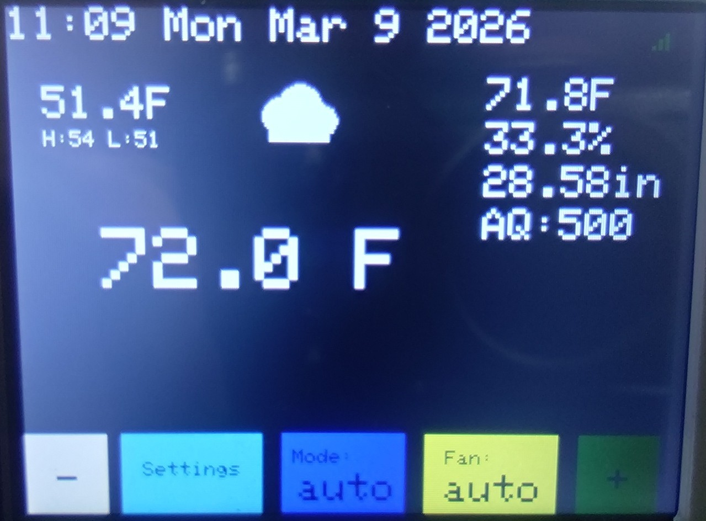
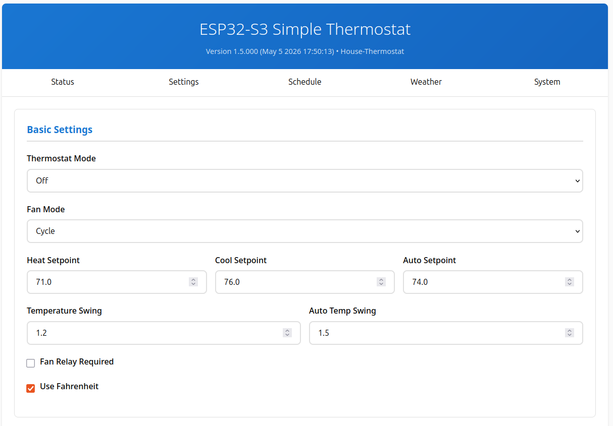
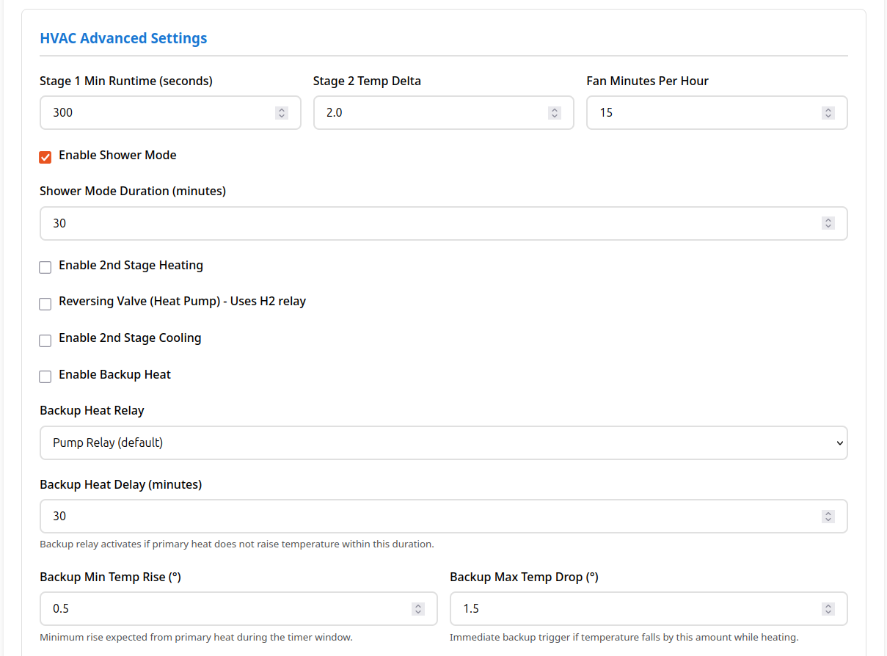
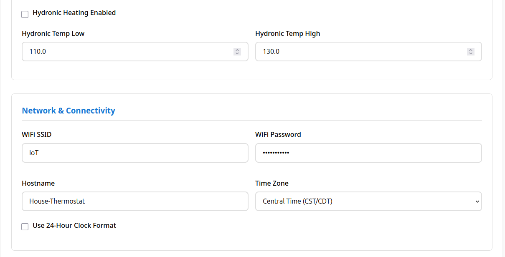
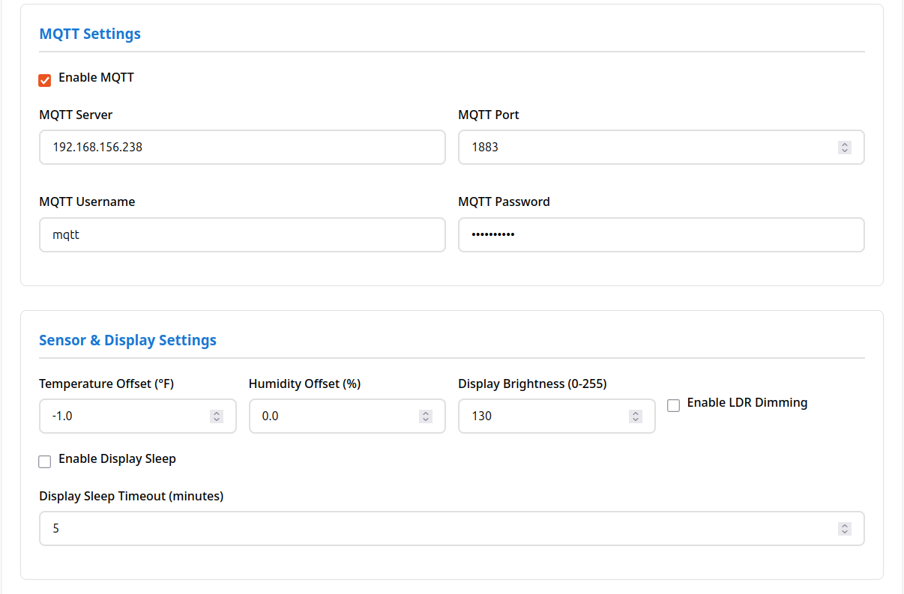
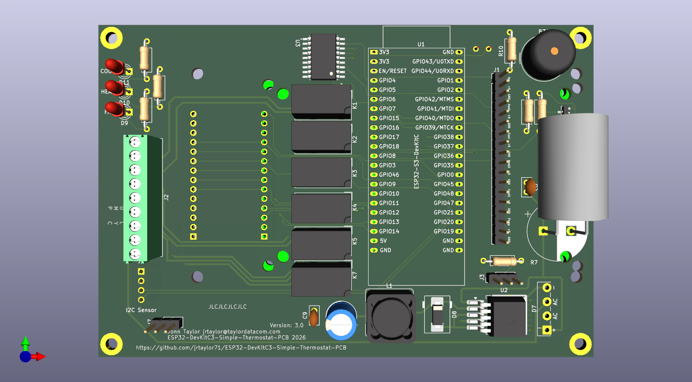
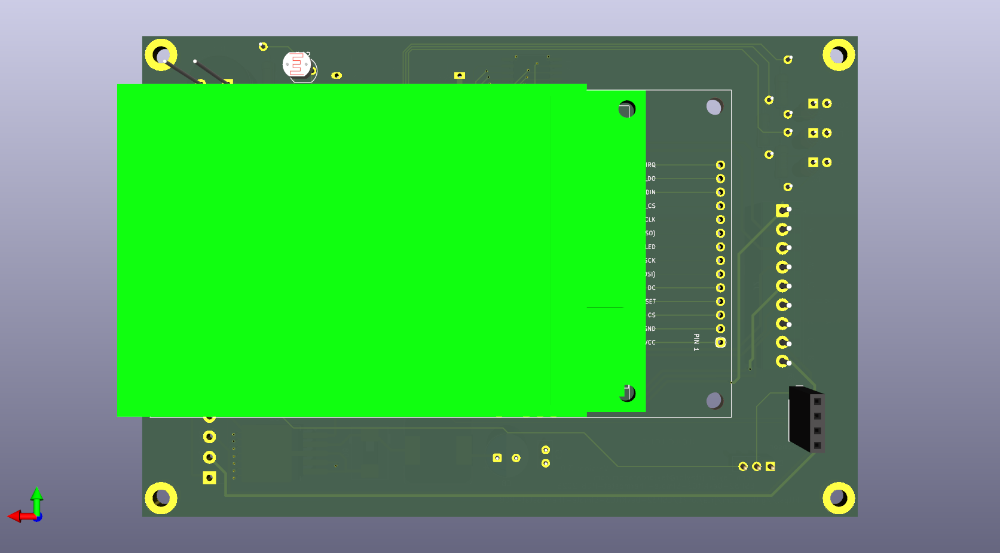

# ESP32-S3-Simple-Thermostat

A comprehensive, feature-rich simple thermostat system built on the ESP32 platform with professional PCB design. Perfect for DIY smart home automation with full Home Assistant integration.







## 🌟 Key Features

- **📱 Local Touch Control**: ILI9341 TFT LCD with intuitive touch interface
- **🏠 Smart Home Ready**: Full MQTT integration with Home Assistant auto-discovery and climate entity support
- **📅 Bidirectional Schedule Sync**: 7-day schedules with day/night periods, HA helper automation, and live two-way update flow
- **🌡️ Multiple Sensors**: AHT20/BME280 ambient temperature and humidity plus DS18B20 hydronic water sensing
- **⚡ Multi-Stage HVAC**: Support for 2-stage heating and cooling, stage timing, delta thresholds, and stage 2 runtime logic
- **🌍 Regional HVAC Behavior**: Switchable US mode (standard temperature-driven cooling) or EU mode (adds optional humidity-driven dehumidification support alongside temperature control)
- **🔄 Heat Pump Ready**: Reversing valve support and heat-pump-compatible staging logic
- **🔥 Backup Heat Monitoring**: Auxiliary heat fallback logic with delay windows and temperature-drop detection
- **💨 Advanced Fan Control**: Auto, continuous, and scheduled cycling modes with independent heat/cool fan relay requirements
- **🔥 Separate Heat/Cool Fan Logic**: Configure whether the fan relay is needed for heating, cooling, or both for legacy HVAC systems
- **🧯 Hydronic Safety Protection**: DS18B20 water monitoring with lockout logic that blocks unsafe fan/heating operation and protects radiant systems
- **🚿 Shower Mode**: Pause heating for 5-120 minutes with countdown timer and buzzer alert
- **🌤️ Weather Integration**: OpenWeatherMap and Home Assistant weather with color-coded icons, current conditions, and display updates
- **🏢 Multi-Thermostat Support**: Scale from single-device installs to multi-device Home Assistant automation setups
- **🌐 Modern Web Interface**: Complete tabbed interface with embedded scheduling, status monitoring, OTA upload, and settings management
- **📡 Offline Operation**: Full functionality without WiFi connection or internet access
- **🔧 Professional PCB**: Custom PCB design for clean, permanent installation and compact integration
- **🔄 OTA Updates**: Over-the-air firmware updates with real-time progress tracking and reboot recovery
- **🔒 Factory Reset**: Built-in reset capability via boot button for clean default recovery
- **🎭 Motion Detection**: LD2410 24GHz mmWave sensor for automatic display wake and occupancy-aware screen behavior
- **🔊 Audible Alerts**: Buzzer feedback for shower mode, relay events, and user interaction cues
- **🧠 Reliability Features**: Watchdog reset, anti-flicker display refresh, I2C protection, and graceful sensor recovery

## �️ Operating Modes

### Thermostat Modes
- **Off**: All heating, cooling, and fan demand relays are disabled
- **Heat**: Single heat setpoint with configurable swing (hysteresis) to prevent short-cycling
- **Cool**: Single cool setpoint with configurable swing (hysteresis) to prevent short-cycling
- **Auto**: Single setpoint with a wider dead-zone swing; heating and cooling only activate once the temperature moves outside the dead-zone and turn off at the setpoint boundary rather than immediately on dead-zone re-entry

### Fan Modes
- **Auto**: Fan runs only when heating or cooling demand is active, based on the independent heat/cool fan relay requirement settings
- **On**: Fan runs continuously regardless of HVAC demand
- **Cycle**: Fan runs on a repeating schedule (configurable minutes per hour) even without active heating or cooling demand

### Regional HVAC Modes
- **US Mode**: Standard temperature-driven heating and cooling control
- **EU Mode**: Adds an optional humidity-driven dehumidification assist that runs alongside temperature control, using a configurable humidity setpoint, deadband, and dedicated relay selection

### Schedule Modes
- **Scheduled**: Setpoints automatically follow the active day/night period for the current day of week
- **Manual Override**: Adjusting a setpoint while a schedule is active temporarily overrides the schedule for a fixed duration before resuming normal scheduled behavior
- **Disabled**: Schedule following can be turned off entirely in favor of fixed manual setpoints

### Shower Mode
- Temporarily pauses heating for a configurable duration (5-120 minutes)
- Displays a live countdown timer on the touch screen while active
- Buzzer alert signals when the countdown is about to end
- Can be toggled directly from the touch screen setpoint control when enabled in settings

## �🚀 Quick Start

 - PCB V1.x


 - PCB V3.x



### Hardware Requirements
- ESP32-S3-WROOM-1-N16 (16MB Flash, No PSRAM) or N8/N32 variants
- ILI9341 320x240 TFT LCD with XPT2046 Touch Controller
- AHT20 or BME280 Temperature/Humidity Sensor (I2C)
- DS18B20 Temperature Sensor (optional, for hydronic heating)
- LD2410 24GHz mmWave Motion Sensor (optional, for display wake)
- 5x Relay Module for HVAC control
- Custom PCB that can use either onboard relay or external relays via pin header

### Software Setup

#### Option 1: Use Prebuilt Firmware (Recommended)
1. Clone this repository
2. Navigate to `firmware/` directory
3. Find the latest build folder (e.g., `build_YYYYMMDD-HHMMSS/`)
4. Flash using the variant-specific script:
   - **Linux/Mac**: 
     - Default: `./latest_flash_N16.sh` (uses /dev/ttyACM0)
     - Custom port: `./latest_flash_N16.sh /dev/ttyUSB0`
   - **Windows**: 
     - Default: `latest_flash_N16.bat` (uses COM3)
     - Custom port: `latest_flash_N16.bat COM4`
5. Use touch interface to configure WiFi and settings

#### Option 2: Build from Source
1. Install [PlatformIO](https://platformio.org/) IDE
2. Clone this repository
3. Open project in PlatformIO
4. Build firmware using `./build.sh` with options:
   - **Interactive mode**: `./build.sh` (select from menu)
   - **Specific variant**: `./build.sh 1` (N8), `./build.sh 2` (N16), or `./build.sh 3` (N32)
   - **All variants**: `./build.sh all` or `./build.sh 4`
   - **Additional flags**: `clean`, `quiet`, `cleanlibs`
   - **Examples**: 
     - `./build.sh 2` - Build 16MB variant (default)
     - `./build.sh all clean` - Clean build all variants
     - `./build.sh 3 quiet` - Build 32MB silently
     - `./build.sh cleanlibs` - Remove all libraries and packages
5. Memory usage: RAM 25.2% (82728/327680 bytes); Flash 19.0% (1246KB/6553KB for N16)
6. Firmware organized in `firmware/N8/`, `firmware/N16/`, `firmware/N32/` directories
7. Flash using variant-specific scripts:
   - **Linux/Mac**: 
     - Default: `./firmware/latest_flash_N16.sh` (uses /dev/ttyACM0)
     - Custom port: `./firmware/latest_flash_N16.sh /dev/ttyUSB0`
   - **Windows**: 
     - Default: `firmware\latest_flash_N16.bat` (uses COM3)
     - Custom port: `firmware\latest_flash_N16.bat COM5`
8. Use touch interface to configure WiFi and settings

#### Flashing Requirements
- **esptool.py** (installed automatically with PlatformIO)
- **USB connection** to ESP32-S3
- **Boot mode**: Hold BOOT button while connecting USB (if needed)
- **Default serial port**: `/dev/ttyACM0` (Linux/Mac) or `COM3` (Windows)

#### Manual Flashing with esptool

If you need to flash manually using esptool, use the following command:

**Linux/Mac:**
```bash
esptool.py --chip esp32s3 --port /dev/ttyACM0 --baud 460800 --before default_reset --after hard_reset write_flash -z \
    --flash_mode dio --flash_freq 80m --flash_size 16MB \
    0x0 bootloader.bin \
    0x8000 partitions.bin \
    0x10000 firmware.bin
```

**Windows:**
```bash
esptool.py --chip esp32s3 --port COM3 --baud 460800 --before default_reset --after hard_reset write_flash -z \
    --flash_mode dio --flash_freq 80m --flash_size 16MB \
    0x0 bootloader.bin \
    0x8000 partitions.bin \
    0x10000 firmware.bin
```

**Flash addresses for the 3 required files:**
- `bootloader.bin` at address `0x0`
- `partitions.bin` at address `0x8000`
- `firmware.bin` at address `0x10000`

**Adjust for your hardware:**
- Change `--port` to your serial port (Linux: `/dev/ttyACM0` or `/dev/ttyUSB0`, Windows: `COM3`, `COM4`, etc.)
- Change `--flash_size` to `8MB`, `16MB`, or `32MB` to match your ESP32-S3 variant (N8, N16, or N32)

For detailed build and flash instructions, see [USER_MANUAL.md](USER_MANUAL.md)

## 💻 Web Interface

Access the thermostat's web interface by navigating to its IP address:

### Tabbed Interface with Embedded Features

**Status Tab**: Real-time monitoring of:
- Current temperature and humidity
- Thermostat and fan modes
- Relay states and system status
- Weather information (when configured)
- Barometric pressure (with BME280 sensor)

**Settings Tab**: Complete configuration interface for:

- Temperature setpoints and control modes
- MQTT/Home Assistant integration and broker settings
- WiFi network settings and reboot recovery
- Multi-stage HVAC parameters including stage 2 runtime and delta thresholds
- Reversing valve configuration for heat-pump systems
- Backup heat enablement, relay selection, delay timing, and temperature-drop logic
- Hydronic heating controls with low/high water protection thresholds
- Fan scheduling options and independent heat/cool fan relay toggles
- Regional HVAC mode selection for US or EU behavior
- EU humidity dehumidification controls, relay selection, setpoint, and deadband
- Shower mode enable/disable and duration (5-120 minutes)
- Display brightness, sleep, and clock settings
- Temperature/humidity sensor calibration and offsets
- OTA update management and firmware details

**Schedule Tab**: Comprehensive 7-day scheduling:
- Day and night periods for each day of the week
- Editable Heat, Cool, and Auto temperatures for each period
- Time controls for period transitions
- Schedule enable/disable and override controls
- All options always visible - no hidden menus

**Weather Tab**: Weather data configuration:
- OpenWeatherMap API integration
- Home Assistant weather entity integration
- Configurable update intervals (5-60 minutes)
- City/state/country configuration

**System Tab**: Device information and firmware updates:
- System information and uptime
- Firmware version details
- OTA firmware upload with progress tracking
- Reboot and factory reset options

For complete usage instructions, see [USER_MANUAL.md](USER_MANUAL.md)

## 🏠 Home Assistant Integration

### Automatic Discovery & Control
Automatic discovery and integration with Home Assistant:

1. Enable MQTT in thermostat settings
2. Configure MQTT broker details
3. Thermostat appears automatically in Home Assistant with a full climate entity and status payloads
4. Full control via Home Assistant interface
5. Supports climate entity with heating, cooling, auto, and off modes
6. Publishes relay, mode, target, schedule override, and hydronic state for automation use

### Bidirectional Schedule Sync 🔄
Full synchronization between thermostat and Home Assistant:

**Device → HA (Inbound)**: 
- Thermostat publishes complete schedule on boot and config changes
- HA automations automatically update helper entities for each day and period
- Changes made on device instantly visible in HA

**HA → Device (Outbound)**:
- Change any schedule helper in HA (time, temperature, enabled status)
- Automation publishes change to device via MQTT immediately
- Device receives and applies change instantly
- No manual sync needed - fully automatic bidirectional flow

**Multi-Thermostat Support**:
- Each device gets its own set of helpers (shop_thermostat, studio_thermostat, house_thermostat, etc.)
- Centralized multi-device automation handles all thermostats
- Proper hostname normalization for MQTT topics vs. helper IDs
- Can manage 10+ thermostats from single HA instance

**Setup Instructions**:
1. Ensure MQTT is enabled on thermostat
2. Copy `multi_thermostat_schedule_sync.yaml` to HA packages directory
3. Generate per-device packages: `./generate_schedule_package.sh shop_thermostat`
4. Add package to HA configuration
5. Reload automations/scripts in HA
6. Helpers auto-populate from device schedule state

## 🛠️ Advanced Features

### Multi-Stage Operation
- Intelligent staging based on time and temperature
- Configurable stage 2 activation parameters and runtime thresholds
- Prevents system short-cycling and optimizes energy efficiency
- Supports separate heating and cooling stage logic for multi-stage HVAC systems
- Includes runtime gating and dead-zone control behavior for stable operation

### US/EU Regional HVAC Behavior
- Thermostat region mode can be configured for US or EU control behavior
- **US Mode**: Standard temperature-driven heating and cooling control
- **EU Mode**: Adds optional humidity-driven dehumidification assist that runs alongside temperature control, with configurable setpoint and deadband
- Standalone dehumidification state is surfaced to web status and TFT display
- Works with relay selection modes for cooling stage 1, stage 2, or pump relay output

### Heat Pump and Backup Heat Support
- Reversing valve support for heat-pump systems with mode-aware valve control
- Backup heat logic can monitor a primary heat source and automatically add auxiliary heat when recovery stalls or temperature falls too quickly
- Relay conflicts are automatically managed so backup heat does not overlap with reserved stage 2 or reversing valve outputs
- Works alongside standard heating and cooling staging without forcing a single control strategy

### Hydronic Heating Support
- DS18B20 water temperature monitoring
- Safety interlocks prevent operation when water is too cold
- Configurable high/low temperature thresholds
- Hydronic lockout logic blocks unsafe heating/fan behavior when the loop is below the configured minimum
- Perfect for radiant floor heating systems and hydronic boiler setups

### Fan Control Options
- **Auto**: Fan runs only with heating/cooling
- **On**: Continuous fan operation
- **Cycle**: Scheduled fan operation (configurable minutes per hour)
- **Independent Heat/Cool Relay Settings**: Choose whether a fan relay is required while heating, while cooling, or for both modes
- **Legacy HVAC Compatibility**: Supports systems where the fan is required for cooling only, heating only, or both without forcing a single global setting

### Display, Sensor, and Safety Enhancements
- Motion-based wake on LD2410 radar occupancy detection
- Display sleep and dimming support with activity sensing
- Buzzer feedback for alerts, boot tones, and mode transitions
- Watchdog protection, OTA recovery, and factory reset support
- AHT20/BME280 temperature/humidity calibration offsets and sensor error recovery
- I2C mutex protection to prevent bus contention between sensors and display logic
- Anti-flicker display refresh logic and stable UI updates
- Hydronic low-temp alert publishing and lockout recovery monitoring for radiant systems

### Included Hardware and Support Features
- 5 relay outputs for heating, cooling, and fan control
- Optional DS18B20 hydronic sensor and LD2410 motion sensor
- Local TFT UI with touch controls and embedded settings
- Web interface for complete configuration and status polling
- OTA firmware upload through the device’s system tab
- Compatibility with both single-device and multi-thermostat Home Assistant installations

## 🖨️ 3D Printable Case

A professional two-part case design is included for clean wall-mount installation:

### Case Features
- **Two-part screw-retained design**: Front (display side) and back (wall-mount side) halves
- **Integrated PCB mounting**: Built-in standoffs (13mm height) for secure PCB installation
- **Countersunk front screws**: 4× M2.5 countersunk (DIN 7991), 10–12mm length, 7mm inset
- **Keyhole wall mounting**: Easy installation without removing case (83mm spacing)
- **Display opening**: Precise 50mm × 68mm opening for 3.2" ILI9341 touchscreen (rotated 90°)
- **AHT20 sensor + LDR cutouts**: 12.5×6mm rectangle (rotated 90°) and Ø5.5mm hole
- **Wire management**: 22mm back pass-through plus side ventilation slots
- **Ventilation**: Strategically placed slots for optimal heat dissipation
- **Professional finish**: Smooth surfaces and rounded edges

### Files Included
- `case/freecad_front_case.py` - Front case (display side) FreeCAD Python script
- `case/freecad_back_case.py` - Back case (wall-mount side) FreeCAD Python script
- `case/freecad_outputs/front_case_display_freecad.stl` - Front half for 3D printing
- `case/freecad_outputs/back_case_wall_freecad.stl` - Back half for 3D printing
- `case/freecad_outputs/front_case_display_freecad.FCStd` - Front case FreeCAD project
- `case/freecad_outputs/back_case_wall_freecad.FCStd` - Back case FreeCAD project
- `case/freecad_outputs/front_case_display_freecad.step` - Front case STEP format
- `case/freecad_outputs/back_case_wall_freecad.step` - Back case STEP format
- `case/freecad_outputs/CE5_front_case_display_freecad.gcode` - Creality Ender 5 gcode (front)
- `case/freecad_outputs/CE5_back_case_wall_freecad.gcode` - Creality Ender 5 gcode (back)

### Print Specifications
- **Material**: PLA or PETG recommended
- **Layer height**: 0.2mm
- **Infill**: 15-20%
- **Supports**: None required
- **Print time**: ~7–9 hours total
- **Dimensions**: 149.0mm × 105.5mm × ~47mm (assembled)
  - Front: ~17.1mm (2.5mm wall; 13mm standoffs; front walls 1.6mm above standoffs)
  - Back: ~30.1mm (2.5mm wall; 20mm component clearance; bosses/keyholes)

**STL Files Location**: All printable STL files are in the `case/freecad_outputs/` directory.

### Motion Detection
- **LD2410 24GHz mmWave Sensor**: Automatic display wake on motion detection
- **Hardware Pins**: RX=15, TX=16, Motion=18
- **Robust Detection**: Works with sensors that don't respond to UART commands
- **Home Assistant Integration**: Motion sensor auto-discovery and status publishing
- **Energy Saving**: Display automatically sleeps when no motion detected
- **Seamless Operation**: Works alongside existing touch controls

### Safety Features
- Watchdog timer prevents system lockups
- Factory reset via boot button (10+ seconds)
- Temperature limit enforcement
- Graceful offline operation

## 🔧 Factory Reset

Press and hold the boot button for more than 10 seconds while the thermostat is running to restore all settings to defaults.

## 📄 License

This project is released under the GNU General Public License v3.0. Free to use, modify, and distribute. NOT for commercial use.

## 🤝 Contributing

Contributions welcome! Please:
1. Fork the repository
2. Create a feature branch
3. Make your changes
4. Submit a pull request

## 📞 Support

- **Issues**: Use GitHub Issues for bug reports
- **Discussions**: GitHub Discussions for questions
- **Documentation**: Comprehensive docs included
- **Serial Debug**: Detailed logging at 115200 baud

## 🙏 Credits & Acknowledgments

**Firmware**: Jonn Taylor - Enhanced firmware implementation

**Created for the DIY smart home community**
